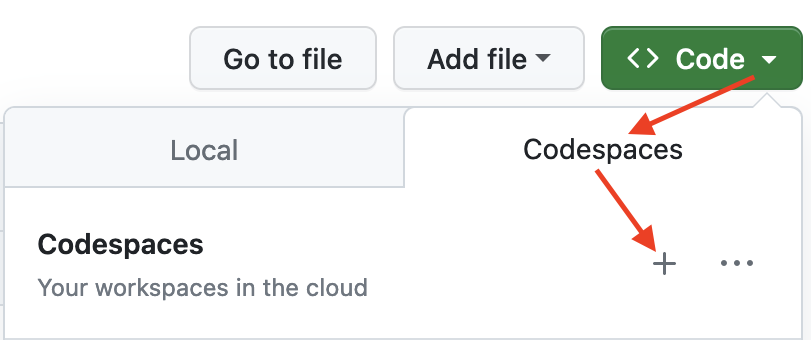

# Minimal(ish) codespaces environment for R

To get started, simply click on the green "Code" button at the top right. Then
select the "Codespaces" tab and click the "+" symbol to start a new Codespace.

The first time you do this, it will open up a new browser tab where your Codespace
is being instantiated. This first-time instantiation will take about 5 minutes
(feel free to click "View Logs" to see how things are progressing). But your
Codespace should deploy almost immediately when you use it again in the future.

Once the VS Code editor opens up in your browser, feel free to open up the
`Example.R` and run the code: Hover on or highlight line(s) and click `Cmd`+`Return`
(Mac) / `Ctrl`+`Return` (Linux / Windows).

Don't forget to close your Codespace once you have finished using it. Click the blue
"Codespace" tab at the very bottom left of your VS Code editor and select "Close the
current codespace" in the resulting pop-up box.
